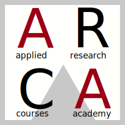

<!-- README.md is generated from README.Rmd. Please edit that file -->

```{r, include = FALSE}
knitr::opts_chunk$set(
  collapse = TRUE,
  comment = "#>",
  out.width = "100%"
)
```



# Basi di R e R Markdown

<!-- badges: start -->
<!-- badges: end -->

# Il Corso

Questa è la repository principale del corso dove ci saranno tutte le
informazioni, slides, link e materiale. Per consultare direttamente il
materiale è possibile accedere al sito del corso https://arca-dpss.github.io/course-r-Rmarkdown/.

# ARCA (Applied Research Courses Academy)

I corsi ARCA sono dei corsi avanzati e fortemente applicativi riguardo
gli strumenti moderni per la ricerca in Psicologia. Sono organizzati dal
Dipartimento di Psicologia dello Sviluppo e della Socializzazione presso
l’Università degli Studi di Padova. Al link
[dpss.unipd.it/arca](https://www.dpss.unipd.it/arca) è possibile avere
informazioni dettagliate su tutti i corsi attivi.
