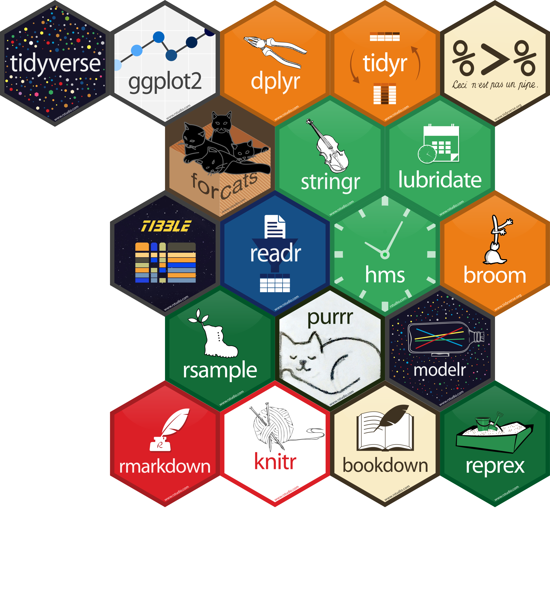

```{r setup, include=FALSE}
library("tidyverse")
library("kableExtra")

# Chunks settings
knitr::opts_chunk$set(echo = FALSE,
                      # Plot settings
                      fig.align='center', dpi = 500,
                      # dev = "tikz", dev.args=list(pointsize=12),
                      # fig.height=3, fig.width=5, fig.pos = "!ht",

                      # Code output width
                      # comment = NA, prompt = TRUE,
                      collapse = TRUE,

                      # Cache options
                      cache = FALSE, autodep=TRUE)

# Console output width
options(width = 80)

options(crayon.enabled = TRUE)

old.hooks <- fansi::set_knit_hooks(knitr::knit_hooks)
# Option KableExtra
# options(knitr.kable.NA = '')

## ggplot settings
theme_set(theme_bw()+
            theme(text = element_text(size=12)))


options(htmltool.dir.version = FALSE)
xaringanExtra:::use_freezeframe()

tryCatch(
    devtools::load_all("../../"),
    error = function(x){
      devtools::load_all()
      })
```

# Tidyverse

.pull-left-70[
```{r}

```

]

.pull-right-30[]

---

# Tidyverse

.pull-left-70[
```{r}

```

]

--

.pull-right-30[
```{r, out.width="80%"}
knitr::include_graphics("images/r4ds-cover.png")
```

https://r4ds.had.co.nz/
]

---
class: size-small
# Data Wrangling

.pull-left-50[
### tibble 

- `tibble()`
- `as_tibble()`

```{r, echo=TRUE, eval=FALSE}
as_tibble(mtcars)
```
```{r, }
as_tibble(mtcars) %>% 
  print(n = 5, width = 40)
```

]

.pull-right-50[


### readr
.pull-left-50[
- `read_csv()`
- `read_csv2()`
- `read_delim()`
- `read_tsv()`
]

.pull-right-50[
- `write_csv()`
- `write_csv2()`
- `write_delim()`
- `write_tsv()`
]

### Pipes

.pull-left-50[
- magrittr `%>%`
```{r, eval = FALSE, echo=TRUE}
mtcars %>% 
  group_by(cyl) %>% 
  count()
```

]

.pull-right-50[
- native R `|>`
```{r, eval = FALSE, echo=TRUE}
mtcars |>
  group_by(cyl) |>
  count()
```
]

]

---
class: size-small
# Data Wrangling

.pull-left-50[
### dplyr 

Manipulate Columns

- `mutate()`, compute new columns
- `rename()`, rename columns
- `select()`, select columns

Manipulate Rows

- `filter()`, select rows by logical criteria
- `slice()`, select rows by position
- `arrange()`, order rows

Group Cases

- `group_by()`, group by columns values
- `ungroup()`, return ungrouped data
]

.pull-right-50[

.color-white[
### dplyr
]

Summarise Cases

- `summarise()`, compute by group values
- `count()`, get size groups

Combine Tables

- `bind_cols()`, bind tibble by columns
- `bind_rows()`, bind tibble by rows

### tidyr

- `pivot_longer()`, from wide to long data
- `pivot_wider()`, from long to wide data

]

---
class: size-small
# Data Wrangling

.pull-left-50[

### forcats

- `fct_relevel()`, manually reorder factor levels
- `fct_reorder()`, reorder levels by other variable
- `fct_rev()`, reverse level order
- `fct_recode()`, manually change labels

### stringr

- `str_detect()`, detect match in string
- `str_count()`, count matches in string
- `str_replace()`, replace first match
- `str_replace_all()`, replace all matches
- `str_extract()`, return first match
- `str_extract_all()`, return all matches
- `str_split()`, split string by pattern

]

.pull-right-50[


### lubridate

Types of data/time data

- *date*, number of days since 1970-01-01
- *date-time*, number of seconds since 1970-01-01 00:00:00 UTC

Time spans:

- *Durations*, record exact number of seconds 
- *Periods*, record time in *“human”* units
- *Intervals*, spans between a precise points

### purrr

- `map()` apply function to each element
- `map2()` apply function to pairs of elements
- `pmap()` apply function to groups of elements
]
---
class: size-small
# ggplot2

.pull-left-50[
```{r, echo = TRUE, eval=FALSE}
ggplot(data = , aes())
```

### Geoms

.pull-left-50[
One variable

- `geom_density()`
- `geom_histogram()`
- `geom_bar()`

Two variables

- `geom_point()`
- `geom_line()`
- `geom_boxplot()`
- `geom_violin()`
- `geom_density_2d()`
]
.pull-right-50[
Other

- `geom_ribbon()`
- `geom_rug()`
- `geom_text()`
- `geom_errorbar()`

Aes and options

- `color`/`fill`
- `linetype` 
- `shape`
- `size`
- `alpha`
]
]

.pull-right-50[
### Other Settings
.pull-left-50[

Facets

- `facet_grid()`
- `facet_wrap()`

Scales

- `scale_*_continous()`
- `scale_*_discrete()`
- `scale_*_manual()`

Coordinate

- `xlim()`/`ylim()`
- `lims()`
- `coord_cartesian()`
- `coord_flip()`

]
.pull-right-50[

Labels and legend

- `xlab()`/`ylab()`
- `ggtitle()`
- `labs()`
- `annotate()`
- `guides()`

Themes

- `theme_bw()`
- `theme_classic()`
- `theme_minimal()`
- `theme_void()`
- `theme(<custom>)`
]
]

---
class:size-small

# ggplot2

.pull-left-50[

```{r, echo = TRUE, eval=FALSE}
ggplot(mtcars, aes(x = mpg)) +
  ggdist::stat_halfeye(
    adjust = .5, .width = 0, 
    justification = -.2, point_colour = NA,
    fill = "#46ACC8", alpha = .7
    ) +
  geom_boxplot(
    fill = "#46ACC8", alpha = .4, width = .25
    colour = "#46ACC8", outlier.shape = NA
    ) +
  geom_point(
    aes(y = 0), size = 1.3,alpha = .3,
    position = position_jitter(seed = 1,
                               height = .1)
    ) +
  theme_bw() +
  theme(axis.title.y = element_blank(),
        axis.line.y = element_blank(),
        axis.text.y = element_blank(),
        axis.ticks.y = element_blank())
```
]
.pull-right-50[

<br>

<br>

```{r, out.width="95%", fig.asp=.6}
ggplot(mtcars, aes(x = mpg)) +
  ggdist::stat_halfeye(adjust = .5, .width = 0, justification = -.2,
                       point_colour = NA, fill = "#46ACC8", alpha = .7) +
  geom_boxplot(fill = "#46ACC8", alpha = .4, colour = "#46ACC8",
               width = .25, outlier.shape = NA) +
  geom_point(aes(y = 0), size = 1.3,alpha = .3,
               position = position_jitter(seed = 1, height = .1)) +
  theme_bw() +
  theme(axis.title.y = element_blank(),
        axis.line.y = element_blank(),
        axis.text.y = element_blank(),
        axis.ticks.y = element_blank())
```
]


---
class: end, middle, center

# Thanks!
