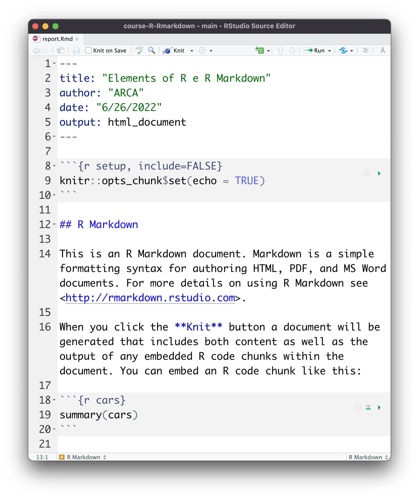
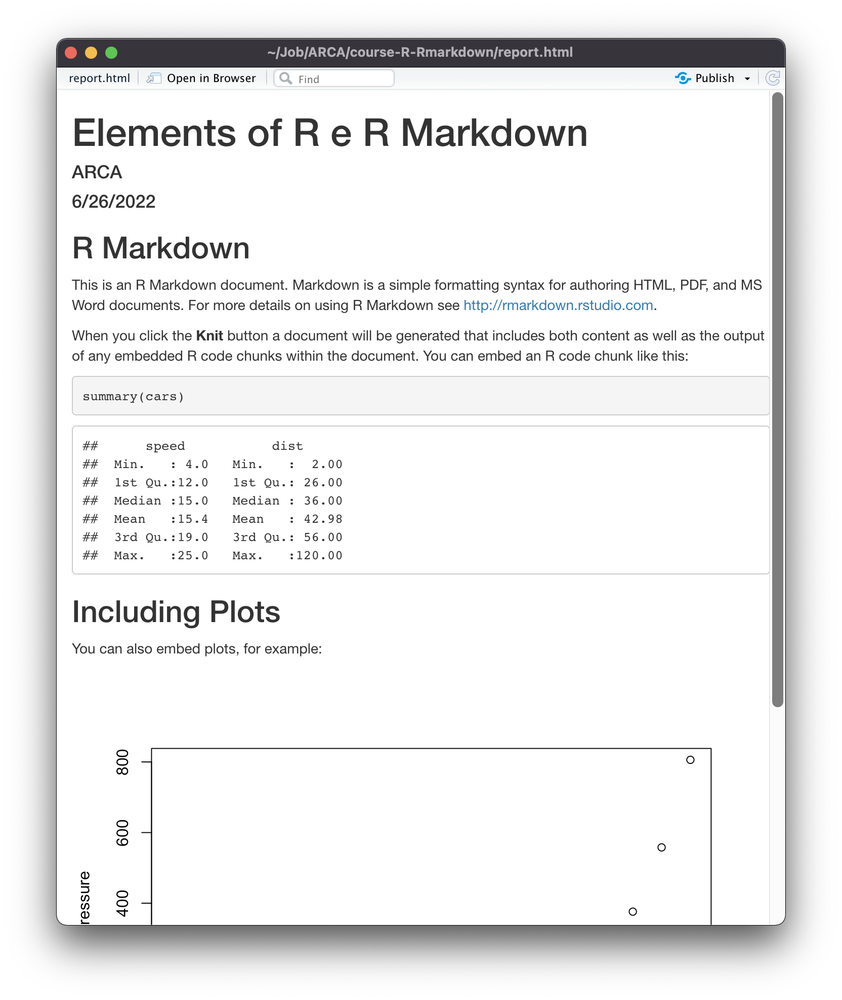
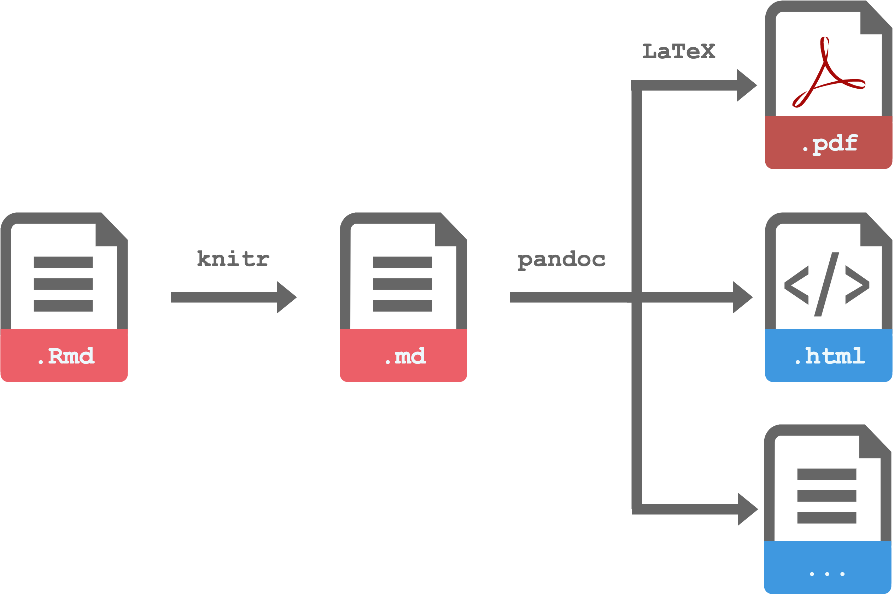

```{r setup, include=FALSE}
library("tidyverse")
library("kableExtra")

# Chunks settings
knitr::opts_chunk$set(echo = FALSE,
                      # Plot settings
                      fig.align='center', dpi = 500,
                      # dev = "tikz", dev.args=list(pointsize=12),
                      # fig.height=3, fig.width=5, fig.pos = "!ht",

                      # Code output width
                      # comment = NA, prompt = TRUE,
                      collapse = TRUE,

                      # Cache options
                      cache = FALSE, autodep=TRUE)

# Console output width
options(width = 80)

options(crayon.enabled = TRUE)

old.hooks <- fansi::set_knit_hooks(knitr::knit_hooks)
# Option KableExtra
# options(knitr.kable.NA = '')

## ggplot settings
theme_set(theme_bw()+
            theme(text = element_text(size=12)))


options(htmltool.dir.version = FALSE)
xaringanExtra:::use_freezeframe()

tryCatch(
    devtools::load_all("../../"),
    error = function(x){
      devtools::load_all()
      })
```

class: size-small
# Document Structure

.pull-left-50[
### Source File
```{r, out.width="80%"}

```

]

--

.pull-right-50[

#### YAML header

```yaml
---
title: "Untitled"
author: "ARCA"
date: "6/26/2022"
output: html_document
---
```

#### Markdown text

```
## R Markdown

This is an R Markdown document [...]
When you click the **Knit** button [...]

```

#### R code

````
```{r cars}`r ''`
summary(cars)
```
````
]

---
class: size-small
# Document Structure

.pull-left-50[
### Source File
```{r, out.width="80%"}

```

]

.pull-right-50[
### Compiled Output

```{r, out.width="80%"}

```
]

---

# R Markdown Workflow

```{r, out.width="65%"}

```

---
class: size-small
# Markdown Syntax

.pull-left-50[
.pull-left-50[
```
plain text

*italics* and _italics_
**bold** and __bold__
***bold-italic***  
`code`


# Header 1
## Header 2
### Header 3
#### Header 4  


> blockquote

[link](https://...)
image:  
 
```
]
.pull-right-50[
plain text

*italics* and _italics_  
**bold** and __bold__  
***bold-italic***  
`code`

<div class="example">
<h1>Header 1</h1>
<h2>Header 2</h2>
<h3>Header 3</h3>
<h4>Header 4</h4>
</div>

> blockquote

[link](https://www.dpss.unipd.it/arca/home)

image:

```{r, out.width="30%"}
knitr::include_graphics("images/arca-logo.svg")
```

]

]

.pull-right-50[
.pull-left-50[
```
Unordered list:

- item
- item
  - sub-item

Ordered list:

1. first
1. second
  1. sub-item
  1. sub-item
  
Table:

Col-1 | Col-2
----- | -----
  A   |   B
  C   |   D
```
]

.pull-right-50[
Unordered list:

- item
- item
  - sub-item

Ordered list:

1. first
1. second
  1. sub-item
  1. sub-item
  

Table:

Col-1 | Col-2
----- | -----
  A   |   B
  C   |   D
]

]

---
class: size-small

.pull-left-50[
# Code
#### Inline Code

The result is `` `r '\x60r round(3.46, 1)\x60'` ``  
The result is `r round(3.46, 1)`

#### Chunk
````
```{<engine> <chunck-name>, <options, ...>}`r ''`
<body>
```
````

#### Chuncks setup
````
```{r setup, include=FALSE}`r ''`
library("<package-name>")

# Chunk default settings
knitr::opts_chunk$set(echo = FALSE,
                      <other-options>,
                      ...)

# Other options
options(width = 80)
```
````
]

.pull-right-50[

### Knitr Chunk Options

https://yihui.org/knitr/options/

.pull-left-50[
#### Code Evalaution
- eval

#### Text Output
- echo
- include
- collapse (only html)
- results
- message
- warning
- error

#### Format
- prompt
- comment
- size
]

.pull-right-50[
#### Figures

- dev
- dev.args
- dpi
- fig.width, fig.height
- fig.asp
- out.width, out.height
- fig.align
- fig.pos (only LaTeX)
- fig.cap
- fig.scap (only LaTeX)
- sanitize (only LaTeX)

#### Other

- cache
- child
]
]


---
class: size-small
# YAML Header

.pull-left-50[
```{r, eval = FALSE, echo = TRUE}
---
title: "My Beatiful Paper"
subtitle: "On something very interesting"
author:
  - First Author^[Institution One]
  - name: Second Author
    affiliation: Institution two
date: "`r format(Sys.time(), '%d %B, %Y')`"
output:
  html_document:
    number_sections: true
    toc: true
  pdf_document:
    latex_engine: pdflatex
    number_sections: true
    toc: true

abstract: |
  This is my abstract.
  
  On multiple lines
---
```

]

.pull-right-50[
.pull-left-50[

#### General Notes

1. YAML is strict about indentation
1. Options repeated for different output formats
1. Path specification is relative to document

#### TOC Options

- toc_depth
- toc_float (only html)
- collapsed (only html)

#### Include Content

<code>
includes:<br>
&emsp;in_header<br>
&emsp;before_body<br>
&emsp;after_body
</code>

]

.pull-right-50[
#### HTML Options

- keep_md 
- css 

#### LaTeX Options

- keep_tex
- documentclass
- classoption
- geometry
- linestretch
- fontsize
- fontfamily

#### Bibliography

- bibliography
- csl
]
]

---
class: size-small
# Outputs

.pull-left-50[
### Default

#### HTML

- `output:html_document`, web page
- `output:ioslides_presentation`, slides 

#### PDF

- `output:pdf_document`, document
- `output:beamer_presentation`, slides

To get pdf outputs we need LaTeX.<br>Easiest way is to use `tinytex`

```{r, echo=TRUE, eval=FALSE}
tinytex::install_tinytex()
```

#### WORD document... really ?!?
]

.pull-right-50[
### Bookdown

```{r, echo=TRUE, eval=FALSE}
install.packages("bookdown")
```

- better for large (multi-page, chapters) documents.
- easier numbering and cross-referencing figures/tables/equations

#### HTML
```{r, echo=TRUE, eval=FALSE}
output:
  bookdown::html_document2 
```

#### PDF
```{r, echo=TRUE, eval=FALSE}
output:
  bookdown::pdf_document2 
```
]

---
class:size-small

# References

.pull-left-50[
```{r, eval=FALSE, echo=TRUE}
bibliography: <ref-file>.bib 
csl: <custom-style>.csl
```

#### `.bib` file

Reference manager as Zotero (https://www.zotero.org/)

```{r, eval=FALSE, echo=TRUE}
@Manual{rcoreteamR,
    title = {R: A Language and Environment for Statistical Computing},
    author = {{R Core Team}},
    organization = {R Foundation for Statistical Computing},
    address = {Vienna, Austria},
    year = {2021},
    url = {https://www.R-project.org/},
  }
```

#### `.cls` file

Get required style from https://www.zotero.org/styles
]

.pull-right-50[

#### Bibliography

By default, is printed at the end of the document. Use `<div id="refs"></div>` to force the position.

```html
# References
<div id="refs"></div>
# Appendix
```

#### Intext Citations

```{r}
cit_key <- c("[@rcoreteamR]", 
             "@rcoreteamR", 
             "[-@rcoreteamR]",
             "[@rcoreteamR, text]", 
             "[text, @rcoreteamR]",
             "[@rcoreteamR; @yihuiRMarkdown2020]")

cit_res <- c("(R Core Team, 2021)", 
             "R Core Team (2021)", 
             "(2021)",
             "(R Core Team, 2021, text)", 
             "(text, R Core Team, 2021)",
             "(R Core Team, 2021; Xie et al., 2020)")

data_table <- data.frame(
  cit_key = cit_key,
  cit_res = cit_res)

kable(data_table, col.names = c("Command", "Result"), escape = FALSE, format = "html") %>%
  kable_styling(bootstrap_options = c("striped", "hover")) %>% 
  column_spec(1, width = "6cm") %>% 
  column_spec(2, width = "6cm")
```

]


---
class:size-small
# Figures

.pull-left-50[

#### Images

````
```{r <tag-fig>, fig.cap = "<caption>", ...}`r ''`
knitr::include_graphics("<path-to-figure>")
```
````

#### Plots
````
```{r <tag-fig>, fig.cap = "<caption>", ...}`r ''`
ggplot(...)+
  ...
```
````

#### In Text Reference (bookdown)

`\@ref(fig:<tag-fig>)`

- Do not use underscore (`"_"`) in the tag-name
- `fig.cap` is required for referencing.
]

.pull-right-50[
#### Options

- `dev`, device for plotting (`'png'`, `'pdf'`, `'tikz'`)
- `dev.args`, settings for the device
- `dpi`, definition (dots per inch)
- `fig.width`/`fig.height`, plot size in inches
- `fig.asp`, plot aspect ratio height/width
- `out.width`/`out.height` size in the document
- `fig.align`, values `'left'`, `'right'`, `'center'`
- `fig.cap`, figure caption

#### Extra LaTeX
- `fig.pos`, values `'h'` (here), `'t'` (top), `'b'` (bottom), `'H'` (HERE need `\usepackage{float}`) 
- `fig.scap`, short caption for list
- `sanitize`, escape special LaTeX characters
]

---
class:size-small
# Tables with kableExtra

.pull-left-50[

```{r, echo = TRUE, eval=FALSE}
install.packages("kableExtra")
```


````
```{r <tag-table>, ...}`r ''`
kable(
  <data>,
  format,
  col.names = NA,
  align,
  caption = "<caption>",
  escape = TRUE,
  ...
)
```
````

#### In Text Reference (bookdown)

`\@ref(tab:<tag-table>)`

- Do not use underscore (`"_"`) in the tag-name
- `caption` is required for referencing.
]

.pull-right-50[
#### Options

- `kable_styling()`, modify style options  (`full_width`, `position`, `font_size`)
  - `bootstrap_options`, specific HTML options (`"striped"`, `"hover"`)
  - `latex_options`, specific LaaTeX options (`"striped"`, `"hold_position"`, `"scale_down"`)
- `add_header_above()`, add a header row on top
- `pack_rows()`, group table rows
- `collapse_rows()`, collapse repeated rows
- `footnote()`, add footnote
- `column_spec()`, customize column look
- `row_spec()`, customize row look


#### Documentation

.pull-left-50[
- [For HTML](https://cran.r-project.org/web/packages/kableExtra/vignettes/awesome_table_in_html.html)
]

.pull-right-50[
- [For PDF](https://cran.r-project.org/web/packages/kableExtra/vignettes/awesome_table_in_pdf.pdf)
]
]
---
class: size-small

.pull-left-50[
## Equations
#### Inline

`$\sqrt{16} = 2^2$` &nbsp;&nbsp; ➡ &nbsp;&nbsp; $\sqrt{16} = 2^2$ 

#### Blocks

```
$$
(\#eq:<tag-equation>)
P(H|D) = \frac{P(H)\ P(D|H)}{P(D)}
$$
```
$$
P(H|D) = \frac{P(H)\ P(D|H)}{P(D)}
$$

- All math symbols ([link]( https://artofproblemsolving.com/wiki/index.php/LaTeX:Symbols))
- LaTeX math syntax ([link](https://www.overleaf.com/learn/latex/Mathematical_expressions))
- In text reference (bookdown) `\@ref(eq:<tag-equation>)`
- Do not use underscore (`"_"`) in the tag-name
]


.pull-right-50[
## Sections

```{r}
sec_key <- c("# My Title", 
             "# Title {#tag-section}", 
             "# Title {.unnumbered}",
             "# Title {-}",
             "# Title {.toc-ignore}")

sec_res <- c("default tag (my-title)", 
             "custom tag (tag-section)", 
             "no number",
             "no number", 
             "no in TOC")

data_table <- data.frame(
  sec_key = sec_key,
  sec_res = sec_res)

kable(data_table, col.names = c("Command", "Result"), escape = FALSE, format = "html") %>%
  kable_styling(bootstrap_options = c("striped", "hover")) %>% 
  column_spec(1, width = "6cm") %>% 
  column_spec(2, width = "6cm")
```

<div style="line-height:1em;">&nbsp;</div>

#### In Text Reference (bookdown)

`\@ref(<tag-section>)`

- Do not use underscore (`"_"`) in the tag-name

#### Referece to custom part

- Create tag: `<a name="tag-section"></a>`
- Link to tag: `[Link to ...]\(\#tag-section\)`
]

---
class: end, middle, center

# Thanks!
