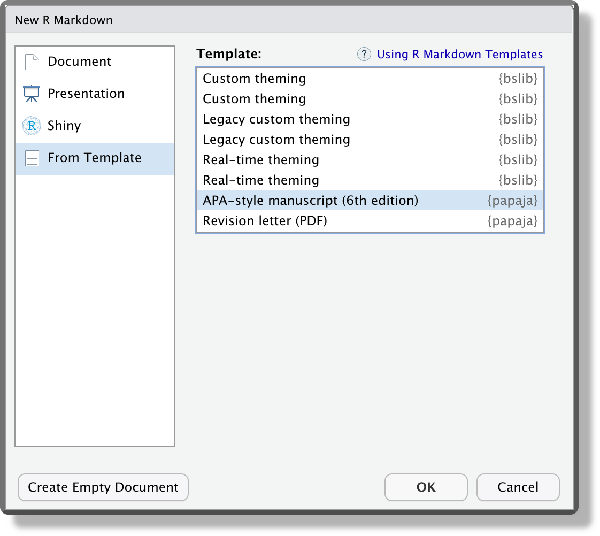

```{r setup, include=FALSE}
library("tidyverse")
library("kableExtra")

# Chunks settings
knitr::opts_chunk$set(echo = FALSE,
                      # Plot settings
                      fig.align='center', dpi = 500,
                      # dev = "tikz", dev.args=list(pointsize=12),
                      # fig.height=3, fig.width=5, fig.pos = "!ht",

                      # Code output width
                      # comment = NA, prompt = TRUE,
                      collapse = TRUE,

                      # Cache options
                      cache = FALSE, autodep=TRUE)

# Console output width
options(width = 80)

options(crayon.enabled = TRUE)

old.hooks <- fansi::set_knit_hooks(knitr::knit_hooks)
# Option KableExtra
# options(knitr.kable.NA = '')

## ggplot settings
theme_set(theme_bw()+
            theme(text = element_text(size=12)))


options(htmltool.dir.version = FALSE)
xaringanExtra:::use_freezeframe()

tryCatch(
    devtools::load_all("../../"),
    error = function(x){
      devtools::load_all()
      })
```

class: size-small
# Advanced HTML

.pull-left-50[

```{r, eval= FALSE, echo = TRUE}
---
output:
  html_document:
    css: ["default.css", "custom.css"]
    includes:
      in_header: header.html
      before_body: before.html
      after_body: after.html
---
```

#### Raw HTML

https://www.w3schools.com/html/

```html
<div class="class-name" id="idname">
  <h1>My title</h1>
  <p> 
  Color <span style="color:red;">red</span>  
  </p>
  <code>x = 2</code>    
</div>
```
]

.pull-right-50[


#### CSS

https://www.w3schools.com/css/

```css
.class-name {
  /*class properties */
}

.class-name h1 {
  /*class element properties*/
}

#idname {
  /* ID properties*/
}
```

#### Extra

- `<br>` line break
- `&nbsp;` non-breaking space


]

---
class: size-small
# $\LaTeX$

.pull-left-50[
```{r, eval= FALSE, echo = TRUE}
---
output:
  pdf_document:
    latex_engine: pdflatex
    includes:
      in_header: preamble.tex
      before_body: header.tex
      after_body: after.tex
---
```

#### Raw $\LaTeX$

```latex
\documentclass{article}
% preamble
\begin{document}
% body
\section{My title}
Color \textcolor{red}{word}
\texttt{x = 2}
\end{document}
```
]

.pull-right-50[
#### $\LaTeX$ Syntax

https://www.overleaf.com/learn

Load packages:<br>
`\usepackage[<options>]{<name-pkg>}`

Formatting

.pull-left-50[
- `\section{}`
- `\subsection{}`
- `\subsubsection{}`
]
.pull-right-50[
- `\textbf{}`
- `\textit{}`
- `\underline{}`
]

Environments

```latex
\begin{figure}[<options>]
  \centering
  \includegraphics[<options>]{<path-fig>}
  \caption{<text>}
  \label{fig:<tag-fig>}
\end{figure}
```
]

---
class: size-small
.pull-left-50[
## Managing Different Outputs

- Choose the output at the beginning 
- Different syntax according to output

```
colorize <- function(x, color) {
  if (knitr::is_latex_output()) {
    sprintf("\\textcolor{&#37;s}{&#37;s}", color, x)
  } else if (knitr::is_html_output()) {
    sprintf("<span style='color: %s;'>%s</span>",
            color, x)
  } else x
}
```

`` `r knitr::inline_expr('colorize("some words in red", "red")')` ``

]

.pull-right-50[
## Papaja - APA Articles

http://frederikaust.com/papaja_man/

```{r, echo = TRUE, eval=FALSE}
devtools::install_github("crsh/papaja")
```

*“File” > “New File” > “R Markdown ...”*


```{r out.width="70%"}

```

]

---
class: size-small
# trackdown - Collaborative Editing

```{r, echo = TRUE, eval=FALSE}
install.packages("trackdown")
```

```{r, out.width="80%"}
knitr::include_graphics("images/trackdown-workflow.png")
```

---
class: end, middle, center

# Thanks!
